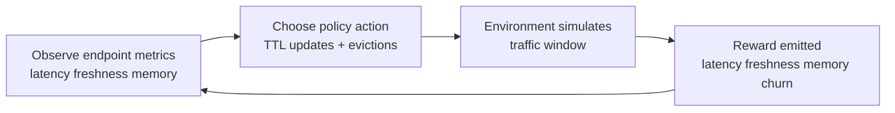

# OpenCachePolicy

[](https://huggingface.co/spaces/tester248/open-cache-policy)
[](https://github.com/meta-pytorch/OpenEnv)
[](#)

OpenCachePolicy is a real-world RL benchmark where an agent operates cache policy like a backend platform engineer.
At each step, the agent must tune endpoint TTLs and eviction choices to balance latency, freshness, and memory.

## What This Environment Does

OpenCachePolicy simulates a practical backend decision loop: how to cache API responses without hurting data quality.
The agent continuously adjusts cache TTL and evictions for multiple endpoints while traffic changes over time.
The environment then scores policy quality using three production-relevant outcomes:

1. Faster response behavior.
2. Lower stale-response risk.
3. Controlled memory usage.

In short, it evaluates whether an agent can make cache-policy tradeoffs that resemble real platform operations.

## Why This Matters

OpenCachePolicy models a real decision problem backend teams face daily:

1. Reduce p95 latency with smart cache usage.
2. Avoid stale responses on volatile endpoints.
3. Stay under finite cache memory.
4. Minimize policy churn that can destabilize systems.

This environment is deterministic and reproducible, making it suitable for reliable model-to-model evaluation.

## At A Glance

1. Problem: online API cache policy optimization.
2. Action: endpoint TTL updates + selective evictions.
3. Observation: endpoint-level traffic/volatility/freshness plus global memory and latency state.
4. Reward: dense multi-objective score each step (latency + freshness + memory - churn).
5. Tasks: easy/medium/hard with strict progression and deterministic fixtures.

## How The Loop Works



## Environment Design

### Task Suite

| Task | Objective | Difficulty Driver |
|---|---|---|
| `task_easy` | Find stable latency wins with safe TTLs | Low volatility, lenient freshness |
| `task_medium` | Trade off latency vs memory under mixed traffic | More endpoints, tighter budget |
| `task_hard` | Maintain performance under bursts and strict SLAs | High volatility + strict freshness |

### Hard Task Production Scenario

`task_hard` mirrors a common high-risk production incident:

1. A traffic surge hits pricing and realtime inventory endpoints.
2. Aggressive long TTLs improve latency briefly, then violate strict freshness.
3. Stale prices or stock counts propagate to users and downstream systems.
4. The agent must recover by reducing TTL on volatile endpoints while preserving overall latency and memory health.

### Action Space

Actions are JSON with two controls:

1. `policy_updates`: endpoint TTL updates.
2. `evict_endpoints`: immediate cache evictions.

Allowed TTL buckets are discrete and deterministic:

1. `0`
2. `5`
3. `30`
4. `120`
5. `600`

### Observation Space

Each step returns both aggregate and endpoint-level signals:

1. Aggregate: weighted latency, baseline latency, stale ratio, memory used, memory budget.
2. Per endpoint: request rate, miss penalty, volatility, freshness SLA, current TTL, estimated hit rate, staleness risk, memory footprint.

### Reward Function

Per-step reward is bounded to `(0.01, 0.99)` and combines:

1. Latency gain ratio (0.50).
2. Freshness health (0.35).
3. Memory health (0.15).
4. Churn penalties for redundant or unstable policy flips.

Final task score is mean step reward.

### Design Tradeoff

OpenCachePolicy intentionally uses discrete TTL buckets instead of continuous TTL actions.
This reduces action noise and makes grading deterministic and reproducible, while still preserving meaningful strategy depth under changing traffic regimes.

## Baseline Results

Recent baseline run using `Qwen/Qwen2.5-72B-Instruct`:

| Task | Score |
|---|---:|
| `task_easy` | `0.730` |
| `task_medium` | `0.713` |
| `task_hard` | `0.636` |
| **Average** | **`0.693`** |

### Live Space Repeatability (3 Runs)

Source: direct runs against deployed Space endpoint `tester248/open-cache-policy`.

| Task | Run 1 | Run 2 | Run 3 | Mean | Range |
|---|---:|---:|---:|---:|---:|
| `task_easy` | `0.730` | `0.802` | `0.802` | `0.778` | `0.072` |
| `task_medium` | `0.703` | `0.670` | `0.744` | `0.706` | `0.074` |
| `task_hard` | `0.634` | `0.649` | `0.623` | `0.635` | `0.026` |
| **Overall Mean** |  |  |  | **`0.706`** |  |

### Result Visualization

```text
task_easy   0.778 |███████████████████████████████
task_medium 0.706 |████████████████████████████
task_hard   0.635 |█████████████████████████
overall     0.706 |████████████████████████████
```

Notes:

1. All 9 task runs completed successfully.
2. `task_hard` remained above the 0.60 success threshold in all three runs.
3. Score variance is controlled and consistent with stochastic model behavior.

## Quick Start

Install dependencies:

```bash
uv sync
```

Run local server:

```bash
uv run server
```

Run baseline inference:

```bash
uv run inference.py
```

Validate and deploy:

```bash
openenv validate
openenv push --repo-id tester248/open-cache-policy
```

## Reproduce Evaluation In 60 Seconds

1. Ensure `.env` contains `HF_TOKEN`, `API_BASE_URL`, and `MODEL_NAME`.
2. Start server with `uv run server`.
3. Run baseline with `uv run inference.py`.
4. Confirm structured logs in `[START]`, `[STEP]`, `[END]` format.

## Required Environment Variables

1. `HF_TOKEN`
2. `API_BASE_URL`
3. `MODEL_NAME`

Optional:

1. `ENV_BASE_URL` (defaults to `http://localhost:8000`)

## Logging Contract

`inference.py` emits structured logs required by evaluation:

1. `[START]`
2. `[STEP]`
3. `[END]`

## Playground Input Guide

In the Hugging Face Playground, the two action fields map directly to your step action:

1. `Policy Updates`: list of endpoint TTL changes.
2. `Evict Endpoints`: list of endpoint IDs to clear immediately.

Use JSON arrays in both fields.

Example `Policy Updates` value:

```json
[
    {"endpoint_id": "search", "ttl_seconds": 120},
    {"endpoint_id": "realtime_stock", "ttl_seconds": 5}
]
```

Example `Evict Endpoints` value:

```json
["offers", "reviews"]
```

No-op step example:

1. `Policy Updates`: `[]`
2. `Evict Endpoints`: `[]`

Sample output format:

```text
[START] task=task_medium env=OpenCachePolicy model=Qwen/Qwen2.5-72B-Instruct
[STEP] step=4 action=search:30;catalog:120 reward=0.72 done=false error=null
[END] success=true steps=8 score=0.713 rewards=0.60,0.69,0.73,0.74,0.74,0.73,0.73,0.74
```

## Repository Layout

```text
.
├── client.py
├── inference.py
├── models.py
├── openenv.yaml
├── tasks.py
└── server
    ├── app.py
    └── open_cache_policy_environment.py
```
